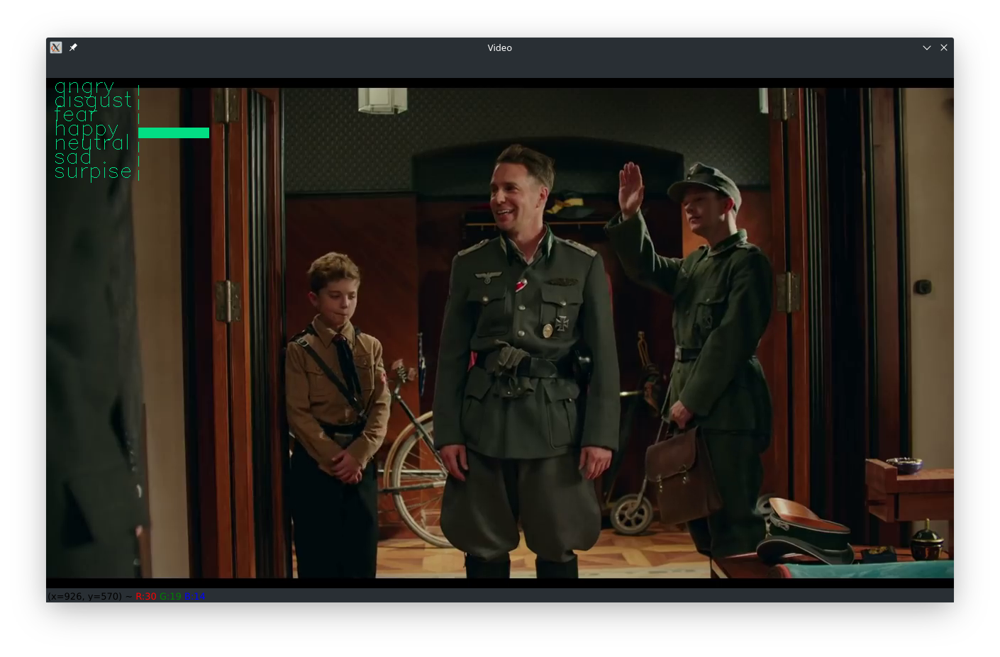

# Emotion Recognition

## Example

Program play video with emotion in rectangle in left top angle.




## Training

Train model write in ```train_model.ipynb```, dataset ```icml_face_data.csv```, but data in csv format, so need
process them into image with ```csv_to_jpg.ipynb```

## Far ahead (To Do)
* flexible code
* add in multimedia player
